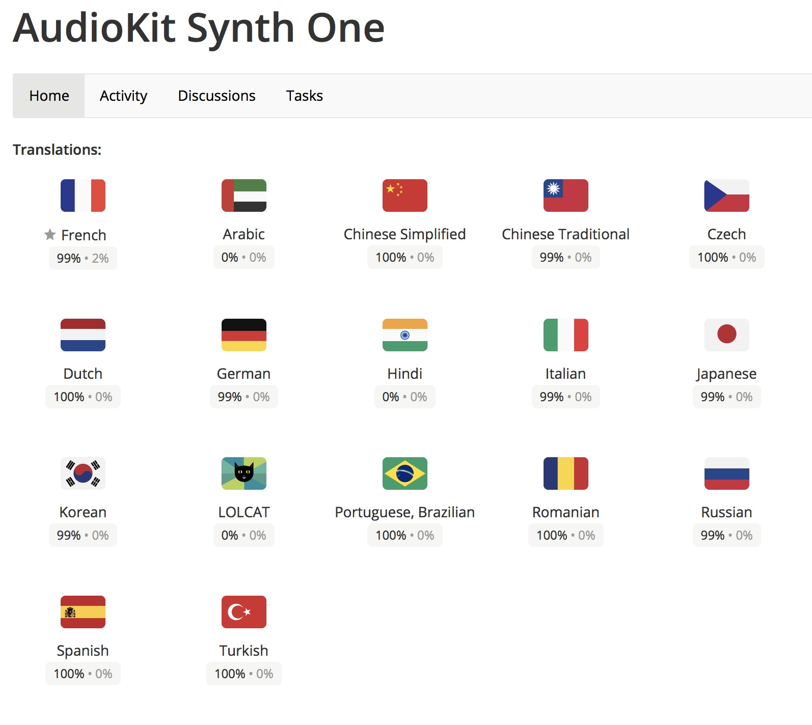
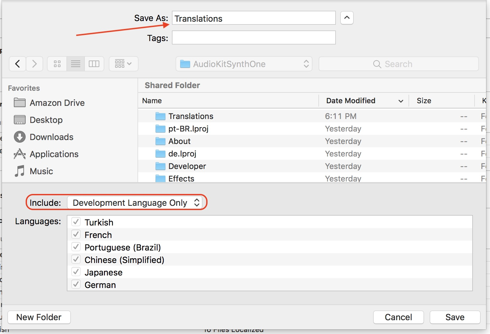

# AudioKit Synth One Translations

## Translating Strings

Do you want to help us localize Synth One into another language, or improve our existing translations? Simply join us on the project's [CrowdIn page](https://crowdin.com/project/audiokit-synth-one).

For each language, you may submit a new translation for strings that have not been translated, or vote on existing translations (you may also submit improved translations if you'd like). If you want to contribute a language we haven't enabled yet, just [let us know](mailto:hello@audiokitpro.com) and we'll add it for you.

Each language has two completion percentages: one is for translation (strings which have at least one translation submitted), and review (proofreading, strings that have received at least one positive vote). Our goal is to get both of these percentages to 100% as much as we possibly can.

As the database of strings is updated, translations are automatically added to the GitHub repository as new commits on the [l10n_develop](https://github.com/AudioKit/AudioKitSynthOne/tree/l10n_develop) branch. Those are then regularly merged back to the main `develop` branch.

## Updating the Database of Strings

The original English strings from the project are extracted by Xcode as an XLIFF file, `en.xliff`. Xcode automatically gathers translatable strings from the project's storyboards, as well as from code where they are marked by the `NSLocalizedString()` call in Swift or Objective-C.

To update these strings the procedure is the following:

- In Xcode, make sure to select the AudioKitSynthOne project at the root of the tree. The localization options will not show in the menu otherwise!
- Go to the `Editor` menu and select `Export for Localization...`
- In the file selection window, change to include the Development Language Only.
- Save as Translations inside the AudioKitSynthOne directory.

If you did it right, it should prompt you whether you want to overwrite the existing file. If it doesn't, you probably exported to the wrong location - oops!

You can then commit and push the updated `en.xliff` file to GitHub on the `develop` branch. CrowdIn will automatically pick up the updated file, import any new or changed strings, and mark them for translation in all the supported languages. Don't forget to tell the translators about it!

## Importing new strings for a language

Each language is stored in a `locale.xliff` file exported by CrowdIn as new translations are submitted. These updates are sent in realtime on the `l10n_develop` branch only, and a special pull request is also open automatically.

For each of the supportef locales, new strings need to be imported in the project from the corresponding XLIFF file. The process is as follows:

- In Xcode, select the AudioKitSynthOne project at the root of the tree.
- Go to the `Editor` menu and select `Import Localizations...`
- Select the file for the language you want to import. For example, to import Brazilian Portuguese strings, select the `pt-BR.xliff` file.

If all goes well, the strings are now available in the selected locale in the app. You may want to compile and test it on a device or in the simulator to make sure that they fit correctly, and make any adjustments as needed.

### Pro Tips

- You can easily test a particular locale, by editing the `AudioKitSynthOne` scheme in Xcode and changing the Application Language in the Options tab for the Run phase of the scheme.
- You may also want to select the Application Region if appropriate (i.e. Portugal or Brazil for Portuguese)
- Running the app with this scheme will then automatically start the app in the selected localization, regardless of your current global locale settings.
- If you noticed that some UI elements or code need to be adjusted to accomodate certain strings, please submit a pull request on the `develop` branch. The `l10n_develop` branch should be reserved for translations imported from CrowdIn and related tasks from the maintainers. You are welcome to check out the latest commits from that branch to test out your translations, however.

